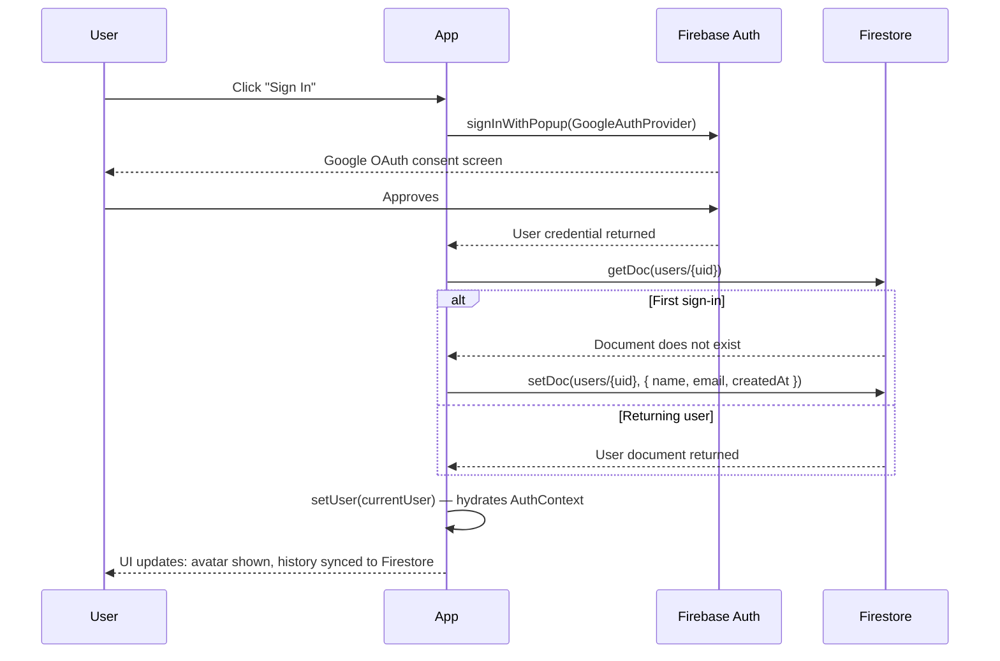
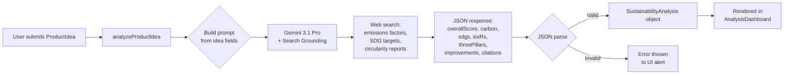

# GreenPrint 🌱

### AI-Powered Sustainability Intelligence for Product Ideas

[](https://ai.studio/apps/d393eaa2-5550-48e6-9235-79adb7a6f6da)
[](https://react.dev)
[](https://www.typescriptlang.org)
[](https://deepmind.google/technologies/gemini/)
[](https://firebase.google.com)
[](LICENSE)

> **Transforms hours of manual sustainability research into a ~1-minute AI-generated Life Cycle Assessment** — scoring product ideas across 4 frameworks, 6 lifecycle stages, and delivering 5+ cited improvement recommendations per analysis.


---

## 📋 Table of Contents

- [Overview](#-overview)
- [Key Features](#-key-features)
- [Tech Stack](#%EF%B8%8F-tech-stack)
- [Project Layout](#-project-layout)
- [Auth & Login Flow](#-auth--login-flow)
- [Application State — AppContext](#-application-state--appcontext)
- [Pages & Views](#-pages--views)
- [Components](#-components)
- [NLP & AI Routing](#-nlp--ai-routing)
- [Hooks & Utilities](#-hooks--utilities)
- [Getting Started](#-getting-started)
- [Known Limitations](#-known-limitations)
- [Contributing](#-contributing)
- [Author](#author)

---

## 🚀 Overview

Sustainability teams and product designers spend 10–40 hours manually assembling Life Cycle Assessments from fragmented academic sources and emissions databases. GreenPrint eliminates that bottleneck.

Architected a full-stack AI product that accepts a product idea as plain text and, in ~1 minute, returns an exhaustive LCA powered by **Gemini 3.1 Pro with real-time Google Search grounding** — mapping environmental impact across 6 lifecycle stages (raw materials → end-of-life), scoring alignment with 5–7 UN Sustainable Development Goals, rating circularity across the 6Rs framework, and producing 3–5 specific, modular improvement recommendations with estimated impact. All analyses are persisted to **Firestore** for authenticated users and exportable as branded PDF reports — turning a research-intensive workflow into a self-service, repeatable product tool.

---

## ⚙️ Key Features

- **Runs full LCA analysis in ~1 minute** — Engineered a Gemini 3.1 Pro pipeline with Search grounding that replaces hours of manual desk research, returning carbon estimates across 6 lifecycle stages with uncertainty ranges and in-text citations.

- **Scores across 4 sustainability frameworks simultaneously** — Integrated Carbon Footprint (LCA), UN SDGs, 6Rs of Circularity (Refuse / Reduce / Reuse / Repair / Repurpose / Recycle), and the 3 Pillars (Environmental / Social / Economic) into a single structured JSON schema, enabling multi-dimensional product evaluation in one pass.

- **Compares product ideas side-by-side** — Shipped a comparison mode that analyzes multiple product ideas and renders a ComparisonDashboard, enabling designers to evaluate eco-alternatives against each other before committing to a direction.

- **Exports PDF reports** — Integrated html2pdf.js to capture the full analysis dashboard as a branded, shareable PDF report — enabling the output to travel outside the tool into stakeholder decks and vendor reviews.

- **Persists history to Firestore with localStorage fallback** — Implemented a dual-storage abstraction (`storage.ts`) that writes analyses to Firestore for authenticated users and localStorage for anonymous sessions, keeping history accessible across page reloads with zero friction.

- **Authenticated sessions via Google OAuth** — Integrated Firebase Auth with Google SSO, Firestore user document creation on first sign-in, and security rules scoped per `userId` — ensuring multi-user safety without a custom backend.

- **Dark / light mode + first-visit onboarding** — Shipped a ThemeToggle and Onboarding overlay (shown once via localStorage flag) to reduce time-to-first-analysis for new users.

---

## 🛠️ Tech Stack

**Frontend**


**AI / ML**


**Infrastructure / Backend**


---

## 🗺️ Project Layout

<details>
<summary>Expand file tree</summary>

```
GreenPrint/
├── src/
│   ├── App.tsx                        # Root component: view routing, analysis orchestration
│   ├── main.tsx                       # React entry point
│   ├── index.css                      # Global styles, CSS variables
│   │
│   ├── components/
│   │   ├── IdeaForm.tsx               # Multi-field product idea submission form
│   │   ├── AnalysisDashboard.tsx      # Full single-product LCA results & charts
│   │   ├── ComparisonDashboard.tsx    # Side-by-side multi-product comparison view
│   │   ├── HistoryDashboard.tsx       # Past analyses browser (load, compare, delete)
│   │   ├── AuthProvider.tsx           # Firebase Auth context + Firestore user management
│   │   ├── LoginModal.tsx             # Google SSO sign-in modal
│   │   ├── LoadingState.tsx           # Step-by-step analysis progress indicator
│   │   ├── Glossary.tsx               # Sustainability terminology reference panel
│   │   ├── Onboarding.tsx             # First-visit guided tour overlay
│   │   ├── ThemeToggle.tsx            # Dark / light mode switcher
│   │   └── ui/
│   │       ├── Accordion.tsx          # Collapsible section component
│   │       ├── Badge.tsx              # Label/tag with color variants
│   │       ├── Button.tsx             # Primary/secondary/ghost button variants
│   │       ├── Card.tsx               # Surface container with border & shadow
│   │       ├── Input.tsx              # Controlled text input
│   │       ├── Textarea.tsx           # Controlled multi-line input
│   │       └── Tooltip.tsx            # Hover tooltip wrapper
│   │
│   ├── lib/
│   │   ├── gemini.ts                  # Gemini AI client, LCA prompt, response parser
│   │   ├── firebase.ts                # Firebase app initialization
│   │   ├── firebaseTypes.ts           # Firestore operation type enums
│   │   ├── storage.ts                 # Firestore / localStorage abstraction layer
│   │   ├── pdf.ts                     # html2pdf.js PDF export wrapper
│   │   └── utils.ts                   # General-purpose helpers (classnames, etc.)
│   │
│   └── types/
│       └── index.ts                   # TypeScript interfaces for all domain models
│
├── firestore.rules                    # Security rules: per-user data isolation
├── firebase-blueprint.json            # Firebase project blueprint
├── firebase-applet-config.json        # AI Studio applet config
├── .env.example                       # Required environment variable template
├── vite.config.ts                     # Vite config with env var injection
├── tsconfig.json
└── package.json
```

</details>

---

## 🔐 Auth & Login Flow



**Anonymous session:** Analysis history is written to `localStorage` via the storage abstraction. On sign-in, the Firestore layer takes over — analyses submitted while authenticated are scoped to the user via Firestore security rules (`request.auth.uid == userId`).

---

## 🧩 Application State — AppContext

Global state is managed in `App.tsx` via React hooks and passed down through `AuthContext` from `AuthProvider`.

| State Slice | Type | Purpose |
|---|---|---|
| `ideas` | `ProductIdea[]` | Current analysis subjects (1 for single, N for comparison) |
| `view` | `'form' \| 'analysis' \| 'comparison' \| 'history'` | Active view routing |
| `isAnalyzing` | `boolean` | Triggers `LoadingState` overlay, disables navigation |
| `loadingMsg` | `string` | Step-by-step progress message from `analyzeProductIdea()` |
| `historyItems` | `ProductIdea[]` | Past analyses loaded from storage on `view === 'history'` |
| `showGlossary` | `boolean` | Controls Glossary panel visibility |
| `showOnboarding` | `boolean` | Controls Onboarding overlay (shown once via localStorage flag) |
| `showLogin` | `boolean` | Controls LoginModal visibility |
| `user` | `Firebase User \| null` | Auth state from `AuthProvider` context |

**Data flow:** `IdeaForm` → `startAnalysis()` → `analyzeProductIdea()` (Gemini API) → `addOrUpdateIdea()` (Firestore / localStorage) → `setIdeas()` → view switches to `analysis` or `comparison`.

---

## 📋 Pages & Views

| View | Trigger | Purpose | Key Components |
|---|---|---|---|
| `form` | Default / "Compare Ideas" click | Product idea input | `IdeaForm` |
| `analysis` | Single-idea submission | Full LCA results, charts, PDF export | `AnalysisDashboard` |
| `comparison` | Multi-idea submission | Side-by-side framework comparison | `ComparisonDashboard` |
| `history` | "History" button | Browse, reload, or compare past analyses | `HistoryDashboard` |

---

## 🧩 Components

**Feature Components**

| Component | Purpose |
|---|---|
| `IdeaForm` | Collects product name, description, category, materials, production location, target market, lifespan, and distribution channel |
| `AnalysisDashboard` | Renders Overall Score, Verdict, Comparative Analysis, Carbon chart (Recharts), SDG badges, 6Rs radar, 3 Pillars breakdown, Improvements, Citations |
| `ComparisonDashboard` | Renders side-by-side scores for all 4 frameworks across multiple ideas |
| `HistoryDashboard` | Lists past analyses with load, multi-select compare, and delete actions |
| `AuthProvider` | Firebase Auth context — exposes `user`, `signIn`, `logOut`, `updateProfileDetails` |
| `LoginModal` | Google SSO sign-in sheet with Firebase `signInWithPopup` |
| `LoadingState` | Animated progress indicator with live step messages from the Gemini pipeline |
| `Glossary` | Sustainability term reference panel (LCA, SDGs, 6Rs, 3 Pillars) |
| `Onboarding` | First-visit guided tour — shown once, dismissed to localStorage |
| `ThemeToggle` | Dark / light mode toggle wired to Tailwind CSS class strategy |

**UI Primitives** (`src/components/ui/`)

`Accordion` · `Badge` · `Button` · `Card` · `Input` · `Textarea` · `Tooltip`

---

## 🧠 NLP & AI Routing

GreenPrint's analysis pipeline is built around a single, highly-engineered prompt in `src/lib/gemini.ts`.

**Model:** `gemini-3.1-pro-preview`
**Tools:** `{ googleSearch: {} }` — enables real-time web grounding for up-to-date emissions factors, SDG targets, and circularity research
**Temperature:** `0.2` — set deliberately low to maximize analytical precision and reduce hallucination
**Response format:** `application/json` with strict schema enforcement

**Prompt design principles:**
- Assigns a senior sustainability analyst persona with explicit LCA methodology instructions
- Requires comparison against the most common conventional alternative (e.g., bamboo vs. plastic toothbrush across all 6 lifecycle stages)
- Enforces in-text citation format `[1]`, `[2]` matched to a `citations` array in the JSON response
- Handles digital products with adapted lifecycle stages (server energy, data transfer, device load)
- Instructs the model to state estimation methodology explicitly when hard data is unavailable

**Prompt → Response flow:**



**Output schema** (TypeScript):

```typescript
interface SustainabilityAnalysis {
  overallScore: number;           // 0–100
  verdict: string;                // Multi-paragraph summary
  comparativeAnalysis?: string;   // vs. conventional alternative
  carbon: CarbonFootprint;        // 6 lifecycle stages + totalKg + uncertainty
  sdgs: SDGs;                     // 5–7 goals + target codes + explanation
  sixRs: SixRs;                   // 6 sub-scores (0–10) + reasons
  threePillars: ThreePillars;     // Environmental / Social / Economic scores
  improvements: Improvement[];    // 3–5 modular recommendations + impact estimate
  citations: Citation[];          // 5+ web sources with url + snippet
}
```

**Fallback handling:** `JSON.parse` errors are caught and rethrown to the UI as an `alert()`. The storage layer is only written to on successful parse — invalid responses are never persisted.

---

## 🔧 Hooks & Utilities

| File | Purpose |
|---|---|
| `src/lib/gemini.ts` | Initializes `GoogleGenAI` singleton, builds LCA prompt from `ProductIdea` fields, calls Gemini API, parses and validates JSON response |
| `src/lib/storage.ts` | `loadHistory()` / `addOrUpdateIdea()` / `deleteIdea()` — routes to Firestore (authenticated) or localStorage (anonymous) transparently |
| `src/lib/firebase.ts` | Initializes Firebase app, `auth`, and `db` instances from environment config |
| `src/lib/pdf.ts` | Wraps `html2pdf.js` to capture a DOM element by ID and trigger browser download |
| `src/lib/utils.ts` | `cn()` utility merging Tailwind classes via `clsx` + `tailwind-merge` |
| `src/components/AuthProvider.tsx` | Exports `useAuth()` hook — provides `user`, `signIn`, `logOut`, `updateProfileDetails` to any component in the tree |

---

## 🚀 Getting Started

**Prerequisites:** Node.js 18+, a [Google Gemini API key](https://aistudio.google.com/apikey), and a [Firebase project](https://console.firebase.google.com) with Auth + Firestore enabled.

```bash
# 1. Clone the repository
git clone https://github.com/yatinbhalla/EcoLens.git
cd EcoLens

# 2. Install dependencies
npm install

# 3. Configure environment variables
cp .env.example .env.local
```

<details>
<summary>Required environment variables (.env.local)</summary>

```env
GEMINI_API_KEY=your_gemini_api_key_here

# Firebase config (from Project Settings > General > Your apps)
VITE_FIREBASE_API_KEY=
VITE_FIREBASE_AUTH_DOMAIN=
VITE_FIREBASE_PROJECT_ID=
VITE_FIREBASE_STORAGE_BUCKET=
VITE_FIREBASE_MESSAGING_SENDER_ID=
VITE_FIREBASE_APP_ID=
```

</details>

```bash
# 4. Start the development server
npm run dev
# → http://localhost:3000

# 5. Build for production
npm run build

# 6. Preview production build
npm run preview
```

**Or try it live →** [GreenPrint on AI Studio](https://ai.studio/apps/d393eaa2-5550-48e6-9235-79adb7a6f6da) *(no setup required)*

---

## 🚧 Known Limitations

- **API key is self-managed** — there is no managed backend proxy; the Gemini key is injected at build time via Vite, which exposes it in the client bundle. For production, route calls through a serverless function.
- **Analysis error handling is alert-based** — failed Gemini calls currently surface as `window.alert()`. A v2 priority is inline error states within the dashboard.
- **No input validation before API call** — the form submits any text to Gemini without pre-processing. Garbage input produces low-quality output rather than a clear validation error.
- **PDF export uses DOM capture** — `html2pdf.js` captures the rendered DOM, which can produce layout artifacts for long analyses or on non-standard screen widths.
- **localStorage analyses don't migrate on sign-in** — analyses made anonymously are not automatically merged into Firestore when the user signs in.
- **Single Gemini model** — `gemini-3.1-pro-preview` is hardcoded; no fallback to a faster/cheaper model for lighter queries.

---

## 🤝 Contributing

GreenPrint is an open product-in-progress and I genuinely welcome collaborators. Whether you've spotted a prompt engineering improvement, have ideas for new sustainability frameworks (LEED? Scope 3?), or want to tackle one of the Known Limitations above — please open an issue or PR.

- **Found a bug?** Open an [Issue](https://github.com/yatinbhalla/EcoLens/issues) with steps to reproduce and your browser/OS.
- **Have a feature idea?** Describe the user problem you're solving, not just the solution — product critiques especially welcome.
- **Want to contribute code?** Fork the repo, create a feature branch, and open a PR against `main`. I'll review within 48 hours.

---

## Author

**Yatin Bhalla · Product Manager & AI Product Builder**

[](https://linkedin.com/in/yatinbhalla42)
[](mailto:yatinbhalla42@gmail.com)
[](https://x.com/yatinbhalla42)
